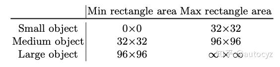

Selective Search （原图上提取建议框）

SPP Net

RPN：得到预测框，边框回归（在feature map上提取建议框----高级特征更优）

FPN：更好的检测小物体和利用原图的空间位置语义----四种形状   upsample

[ROI pooling  与 ROI Align](http://blog.leanote.com/post/afanti.deng@gmail.com/b5f4f526490b)

FCN

Mask R-CNN = RPN + ROIAlign + Fast-rcnn + FCN

高级特征更优

思路：

1. 直接Mask R-CNN
2. 改变卷积大小使其符合甘蔗检测

## 目标检测图片resize

https://www.jianshu.com/p/78533da6c928

### 1、填充像素

若图片大小不够，则可以采用填充像素的方法进行填充

### 2、拉伸图片

## 数据增强

* 离线增强
* 在线增强

### 1、小物体复制

https://arxiv.org/pdf/1902.07296.pdf

### 2、TensorLayer做数据增强

## 目标检测

参考别人的总结：

* https://zhuanlan.zhihu.com/p/34142321
* 

### R-CNN

本文贡献：

1. CNN 可用于基于区域的定位和分割物体
2. 监督训练样本数紧缺时，在额外的数据上预训练的模型经过 fine-tuning 可以取得很好的效果

术语：

1. **Region Proposal （使用的是 Selective Search 算法）**

2. IOC

   

   正样本（如跟 ground truth 的 IoU 大于 0.5）

   负样本（即背景类，如 IoU 小于 0.1）

   介于两者之间的则为**难例**（Hard Negatives），若标为正类，则包含了过多的背景信息，反之又包含了要检测物体的特征，因而这些 Proposal 便被忽略掉

3. **位置坐标的回归（Bounding-Box Regression）**

   是 Region Proposal 向 Ground Truth 调整，实现时加入了 log/exp 变换来使损失保持在合理的量级上，可以看做一种标准化（Normalization) 操作。

### Fast R-CNN

文章指出 R-CNN 耗时的原因是 CNN 是在每一个 Proposal 上单独进行的，没有共享计算，便提出将基础网络在图片整体上运行完毕后，再传入 R-CNN 子网络，共享了大部分计算，故有 Fast 之名。

### Faster R-CNN

提出的 **RPN**（Regional Proposal Networks） **取代** Selective Search 算法使得检测任务可以由神经网络端到端地完成。

粗略的讲，Faster R-CNN = RPN + Fast R-CNN

重叠框问题----非极大值抑制

* 自动感受野
* 调整感受野
* 小感受野

### Mask RCNN

Mask R-CNN = RPN + ROIAlign + Fast-rcnn + FCN

